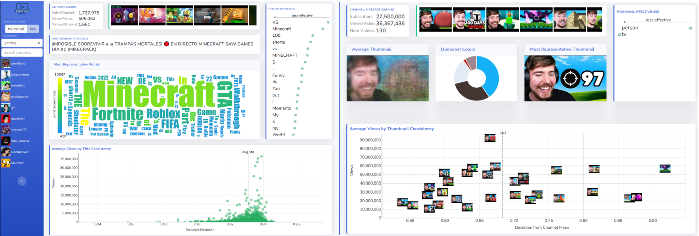

# YT_stats_dash - Multimedia Analytics Project - UvA 2022

We propose YourTube, an information visualization tool to effectively display YouTube’s channel data. The system is
built using a web interface with HTML, CSS, and JavaScript frontend and Python backend. It uses straightforward visualizations
to allow users to gain insight into both simple web scraped, and complicated engineered data. The engineered data is created
using state-of-the-art open-source models, mainly focused on object detection and feature extraction. This data combined with our
visualizations brings out correlations between variables like titles used for videos and the number of views such a video gets. To our
knowledge, this is the first system to effectively present this type of data combined with simple, web scraped data.

Authored by [VasilikiVas](https://github.com/VasilikiVas), [irenepap2](https://github.com/irenepap2), [ObviouslyLuuk](https://github.com/ObviouslyLuuk), [Cyproxius](https://github.com/Cyproxius), [danaiksez](https://github.com/danaiksez)
